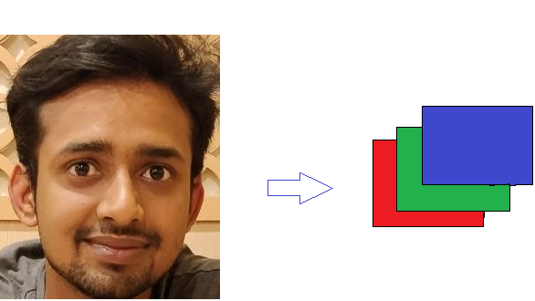
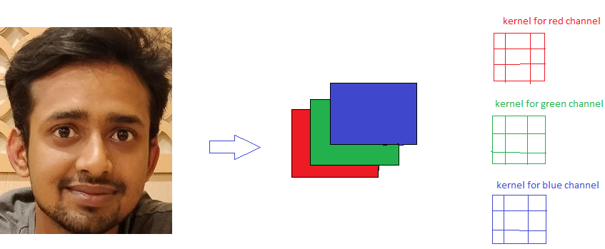

# Assignment 1B

Q1. What are Channels and Kernels (according to EVA)?

<b>Channels</b> <br/>
In general an image is composed of many different components/colours but the way it is perceived by our naked is that we see a combination of these colours.Say we have an image which has 3 different channels. If we consider the value of a pixel in a particular channel,we have the value for that channel only and for the remaining two channels values are zero.

<br/><br/>

<b>Kernels</b><br/>
Kernels are 3x3 matrix which are use to extract features from an image.Hence they are also called "filters" or "feature extarctor".There is one to one relationship between number of incoming channels and number of filters required,one filter per channel.

<br/><br/>

Q2.Why should we only (well mostly) use 3x3 Kernels?<br/>
Because we can obtain obtain any size of output by repetative use of 3x3 kernels(mostly odd to obtain symmetry)

<b>Example:<b/>

9x9 <b>conv<b/> 3x3 ---->7x7 <b>conv<b/> 3x3 ---->5x5 <b>conv<b/> 3x3 ---->3x3 <b>conv<b/> 3x3 ----> 1x1

Q3. How many times do we need to perform 3x3 convolution operation to reach 1x1 from 199x199 (show calculations)<br/>
We need to perform 3x3 convolution operations 99 times to reach 1x1 from 199x199.<br/>
<b>Calculations<b/>
199x199 <b>conv<b/> 3x3 ---->197x197<br/>
197x197 <b>conv<b/> 3x3 ---->195x195<br/>
195x195 <b>conv<b/> 3x3 ---->193x193<br/>
193x193 <b>conv<b/> 3x3 ---->191x191<br/>
191x191 <b>conv<b/> 3x3 ---->189x189<br/>
189x189 <b>conv<b/> 3x3 ---->187x187<br/>
187x187 <b>conv<b/> 3x3 ---->185x185<br/>
185x185 <b>conv<b/> 3x3 ---->183x183<br/>
183x183 <b>conv<b/> 3x3 ---->181x181<br/>
181x181 <b>conv<b/> 3x3 ---->179x179<br/>
179x179 <b>conv<b/> 3x3 ---->177x177<br/>
177x177 <b>conv<b/> 3x3 ---->175x175<br/>
175x175 <b>conv<b/> 3x3 ---->173x173<br/>
173x173 <b>conv<b/> 3x3 ---->171x171<br/>
171x171 <b>conv<b/> 3x3 ---->169x169<br/>
169x169 <b>conv<b/> 3x3 ---->167x167<br/>
167x167 <b>conv<b/> 3x3 ---->165x165<br/>
165x165 <b>conv<b/> 3x3 ---->163x163<br/>
163x163 <b>conv<b/> 3x3 ---->161x161<br/>
161x161 <b>conv<b/> 3x3 ---->159x159<br/>
159x159 <b>conv<b/> 3x3 ---->157x157<br/>
157x157 <b>conv<b/> 3x3 ---->155x155<br/>
155x155 <b>conv<b/> 3x3 ---->153x153<br/>
153x153 <b>conv<b/> 3x3 ---->151x151<br/>
151x151 <b>conv<b/> 3x3 ---->149x149<br/>
149x149 <b>conv<b/> 3x3 ---->147x147<br/>
147x147 <b>conv<b/> 3x3 ---->145x145<br/>
145x145 <b>conv<b/> 3x3 ---->143x143<br/>
143x143 <b>conv<b/> 3x3 ---->141x141<br/>
141x141 <b>conv<b/> 3x3 ---->139x139<br/>
139x139 <b>conv<b/> 3x3 ---->137x137<br/>
137x137 <b>conv<b/> 3x3 ---->135x135<br/>
135x135 <b>conv<b/> 3x3 ---->133x133<br/>
133x133 <b>conv<b/> 3x3 ---->131x131<br/>
131x131 <b>conv<b/> 3x3 ---->129x129<br/>
129x129 <b>conv<b/> 3x3 ---->127x127<br/>
127x127 <b>conv<b/> 3x3 ---->125x125<br/>
125x125 <b>conv<b/> 3x3 ---->123x123<br/>
123x123 <b>conv<b/> 3x3 ---->121x121<br/>
121x121 <b>conv<b/> 3x3 ---->119x119<br/>
119x119 <b>conv<b/> 3x3 ---->117x117<br/>
117x117 <b>conv<b/> 3x3 ---->115x115<br/>
115x115 <b>conv<b/> 3x3 ---->113x113<br/>
113x113 <b>conv<b/> 3x3 ---->111x111<br/>
111x111 <b>conv<b/> 3x3 ---->109x109<br/>
109x109 <b>conv<b/> 3x3 ---->107x107<br/>
107x107 <b>conv<b/> 3x3 ---->105x105<br/>
105x105 <b>conv<b/> 3x3 ---->103x103<br/>
103x103 <b>conv<b/> 3x3 ---->101x101<br/>
101x101 <b>conv<b/> 3x3 ---->99x99<br/>
99x99 <b>conv<b/> 3x3 ---->97x97<br/>
97x97 <b>conv<b/> 3x3 ---->95x95<br/>
95x95 <b>conv<b/> 3x3 ---->93x93<br/>
93x93 <b>conv<b/> 3x3 ---->91x91<br/>
91x91 <b>conv<b/> 3x3 ---->89x89<br/>
89x89 <b>conv<b/> 3x3 ---->87x87<br/>
87x87 <b>conv<b/> 3x3 ---->85x85<br/>
85x85 <b>conv<b/> 3x3 ---->83x83<br/>
83x83 <b>conv<b/> 3x3 ---->81x81<br/>
81x81 <b>conv<b/> 3x3 ---->79x79<br/>
79x79 <b>conv<b/> 3x3 ---->77x77<br/>
77x77 <b>conv<b/> 3x3 ---->75x75<br/>
75x75 <b>conv<b/> 3x3 ---->73x73<br/>
73x73 <b>conv<b/> 3x3 ---->71x71<br/>
71x71 <b>conv<b/> 3x3 ---->69x69<br/>
69x69 <b>conv<b/> 3x3 ---->67x67<br/>
67x67 <b>conv<b/> 3x3 ---->65x65<br/>
65x65 <b>conv<b/> 3x3 ---->63x63<br/>
63x63 <b>conv<b/> 3x3 ---->61x61<br/>
61x61 <b>conv<b/> 3x3 ---->59x59<br/>
59x59 <b>conv<b/> 3x3 ---->57x57<br/>
57x57 <b>conv<b/> 3x3 ---->55x55<br/>
55x55 <b>conv<b/> 3x3 ---->53x53<br/>
53x53 <b>conv<b/> 3x3 ---->51x51<br/>
51x51 <b>conv<b/> 3x3 ---->49x49<br/>
49x49 <b>conv<b/> 3x3 ---->47x47<br/>
47x47 <b>conv<b/> 3x3 ---->45x45<br/>
45x45 <b>conv<b/> 3x3 ---->43x43<br/>
43x43 <b>conv<b/> 3x3 ---->41x41<br/>
41x41 <b>conv<b/> 3x3 ---->39x39<br/>
39x39 <b>conv<b/> 3x3 ---->37x37<br/>
37x37 <b>conv<b/> 3x3 ---->35x35<br/>
35x35 <b>conv<b/> 3x3 ---->33x33<br/>
33x33 <b>conv<b/> 3x3 ---->31x31<br/>
31x31 <b>conv<b/> 3x3 ---->29x29<br/>
29x29 <b>conv<b/> 3x3 ---->27x27<br/>
27x27 <b>conv<b/> 3x3 ---->25x25<br/>
25x25 <b>conv<b/> 3x3 ---->23x23<br/>
23x23 <b>conv<b/> 3x3 ---->21x21<br/>
21x21 <b>conv<b/> 3x3 ---->19x19<br/>
19x19 <b>conv<b/> 3x3 ---->17x17<br/>
17x17 <b>conv<b/> 3x3 ---->15x15<br/>
15x15 <b>conv<b/> 3x3 ---->13x13<br/>
13x13 <b>conv<b/> 3x3 ---->11x11<br/>
11x11 <b>conv<b/> 3x3 ---->9x9<br/>
9x9 <b>conv<b/> 3x3 ---->7x7<br/>
7x7 <b>conv<b/> 3x3 ---->5x5<br/>
5x5 <b>conv<b/> 3x3 ---->3x3<br/>
3x3 <b>conv<b/> 3x3 ---->1x1<br/>

We don't need to waste our time in typing the calculations because we have better things to learn,right ?<br/>
The python code to do that is as follows:<br/>

```
n=199
while n>=3:
    print(f'{n}'+'x'+f'{n}'+ " "+"<b>conv</b> 3x3 ---->"+f'{n-2}'+'x'+f'{n-2}'+"<br/>")
    n=n-2
```
<br/>
Simply print them in IDE and paste in git editor.


