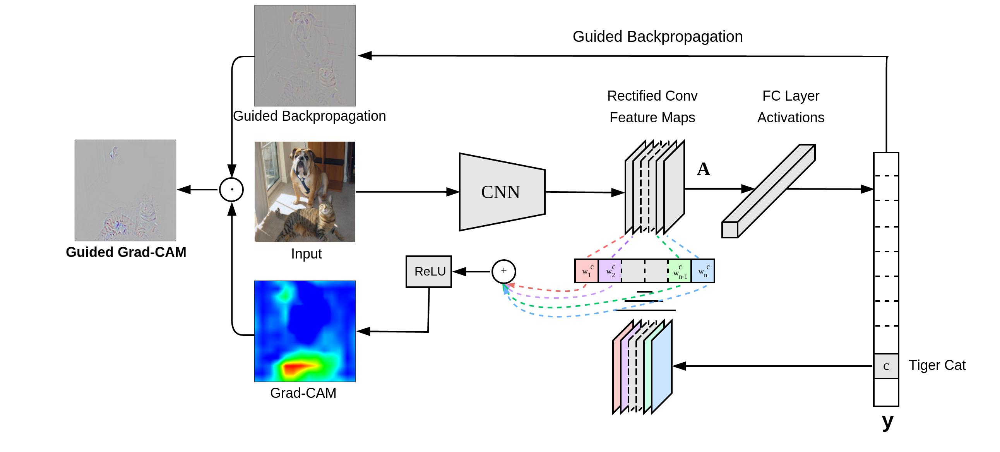
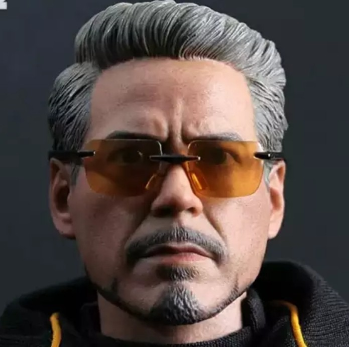

**Objective**

*   To integrate GradCam with pre-trained VGG model.

*   Observe the output of gradcam if we don't pass any class id to it.
*   Find the class id of sunglasses in imagenet and using it find the location of sunglasses in the below image and draw heatmap over it.

   
