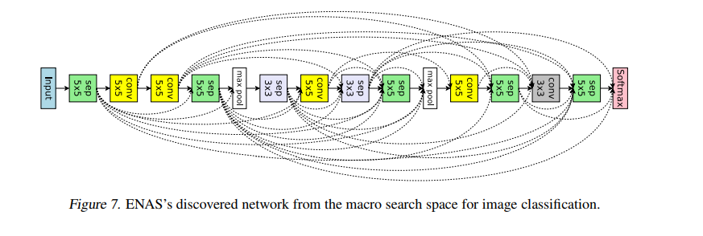

**Objective**
___

To learn usage of Functional API by designing *ENAS neural architecture search.*

* Design this network for CIFAR10 dataset.
* The dotted lines are the skip-connections. We need to add them.
* Train for 100 Epochs (add BN and ReLU after every layer)